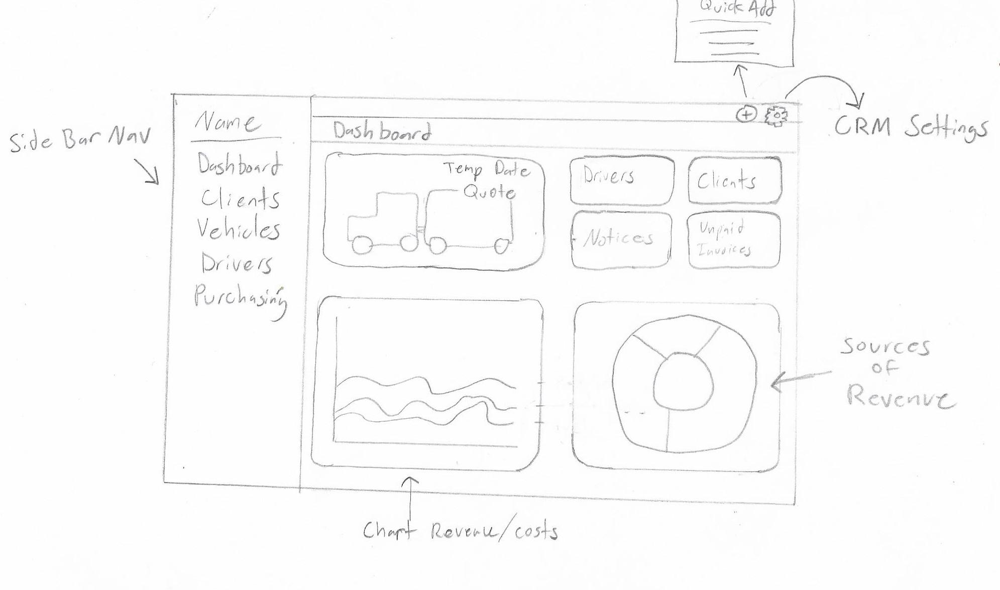

|                      Current Rendering alpha                       |                                                          DashBoard Plan |
| :----------------------------------------------------------------: | ----------------------------------------------------------------------: |
|  |  |

# Packages/libs used

Frontend

- nextjs / reactjs
- tailwindcss
- moment.js
- chart.js react-chartjs-2

Backend

- Nodejs
- cors
- express
- mongoose
- nodemon

# Uses

- save receipts
- save maintenance
- profits
- expeneses
- client / client info / client specific invoices

# wanted Features

- ~~add multiple vehicles~~
- ~~create Clients and add invoices~~
- db connected with CRUD
- handle image receipts
- login users Auth
- display useful info on dashboard with different time period options
